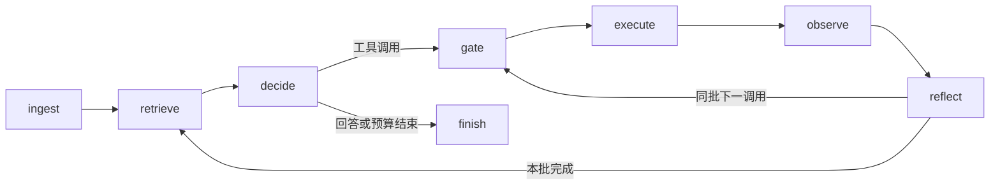

# Evidence Agent

一个小型 Python / LangGraph 智能体框架：模型提出工具调用，由确定性策略校验权限，工具产生结构化证据，后续决策可以检索同一上下文的经验。

这是从专用实验工作流中抽取的通用框架，提供工具接入和流程扩展接口。领域算法、设备驱动、数据与模型服务由使用者接入。

作者：**hatetakename**。许可证：[MIT](LICENSE)。GitHub 仓库名为 `evidence-agent`；Python 分发包名为 `evidence-agent-framework`，导入名为 `agent_framework`。

**English:** A small evidence-driven LangGraph framework with typed tool results, explicit execution grants, bounded orchestration, and context-scoped experience retrieval. The bundled demo is fully offline and uses scripted decisions.

## 快速运行

需要 Python 3.11 或更新版本。在本目录执行：

```bash
python -m venv .venv
# Windows PowerShell
.venv\Scripts\Activate.ps1
# macOS / Linux 使用：source .venv/bin/activate
python -m pip install -e ".[test]"
python -m agent_framework.demo
python -m pytest -q
```

演示和测试不需要 API key，不会调用远程模型或连接设备。首次安装依赖通常需要访问包索引。`agent-framework-demo` 也可启动安装后的演示。

## 框架包含什么



- `AgentState`、`ToolCall`、`ToolResult` 和 `Evidence`：Pydantic 状态与工具边界，拒绝额外字段。
- `ToolRegistry`：登记工具、校验输入、计算包含工具版本和上下文的参数指纹。
- `ExecutionPolicy`：检查前置证据；外部写操作需要绑定任务、上下文、工具和参数指纹的一次性 `ApprovalGrant`。
- `AgentRunner`：显式 LangGraph 节点、按顺序处理工具调用、决策次数上限、重复调用 ID 拦截。
- `InMemoryExperienceStore` / `SQLiteExperienceStore`：同一 `context_id` 内的案例检索，状态与评价结果由代码记录。
- `ScriptedModel`：离线演示与测试；`LangChainDecisionModel`：接入调用方提供的聊天模型。

## 最小例子

```python
from pydantic import BaseModel, ConfigDict

from agent_framework.graph import AgentRunner
from agent_framework.models import ScriptedModel
from agent_framework.state import Decision, ToolCall, ToolOutput
from agent_framework.tools import ToolRegistry, ToolSpec


class AddInput(BaseModel):
    model_config = ConfigDict(extra="forbid")
    left: int
    right: int


tools = ToolRegistry([
    ToolSpec(
        name="add",
        description="Add two integers",
        input_model=AddInput,
        handler=lambda args: ToolOutput(data={"sum": args.left + args.right}),
        effect="local_compute",
        evidence_key="sum",
    )
])
model = ScriptedModel([
    Decision(calls=[ToolCall(tool_name="add", arguments={"left": 2, "right": 3})]),
    Decision(answer="The calculation is complete."),
])
state = AgentRunner(model, tools).run("Add 2 and 3", context_id="example")
assert state.evidence["sum"].output.data["sum"] == 5
```

## 权限与证据边界

自然语言、模型回答及历史经验都不能生成执行许可。外部写入必须由应用代码提供显式授权；授权在调用处理函数前消耗，因此超时或异常也不会自动获得重试机会。

工具输入、上下文或工具版本改变会改变指纹。更新上游证据会使依赖它的下游证据失效。`evaluation_passed` 来自工具评价器；模型说“通过”不会改变评价结果。

这不是执行沙箱。工具处理函数、策略实现及模型适配器是宿主应用信任的 Python 代码；工具的 `effect` 必须由开发者准确声明。上下文隔离用于检索筛选，不替代身份认证或数据库访问控制。

`max_steps` 限制模型决策次数，每次决策最多包含 8 个按序处理的调用；超过上限的整批被拒绝。它不提供处理函数的强制超时、操作系统资源限制或跨进程重复执行保护。状态快照不是自动恢复执行的检查点，重启后的外部动作恢复需由宿主应用另外设计。

## 验证范围

离线测试覆盖授权绑定和消耗、输入拒绝、重复调用 ID、证据失效、预算终止、扩展回调失败、SQLite 复用、模型适配以及无凭证导入。演示使用预先编写的决策序列，展示接口与状态变化，**不是实际 LLM 的成功率基准，也不证明记忆提升效果**。

详细说明：[快速开始](docs/quickstart.md)、[扩展工具与模型](docs/extensions.md)、[设计与限制](docs/design.md)、[贡献说明](CONTRIBUTING.md)、[安全边界](SECURITY.md)、[发布准备](docs/release.md)、[本地验证记录](docs/verification.md)。
